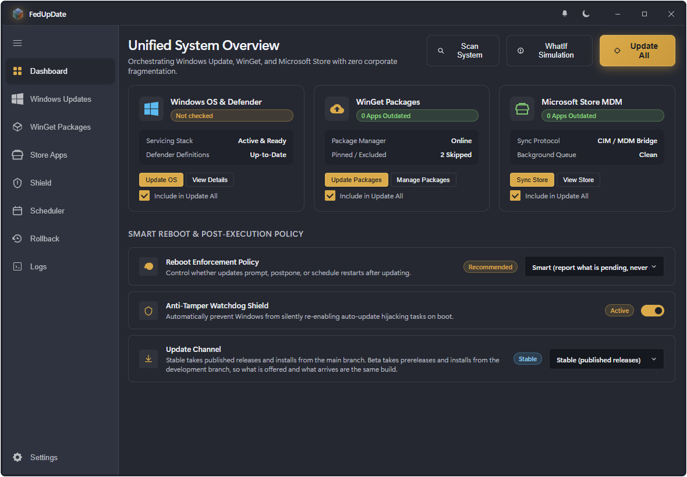
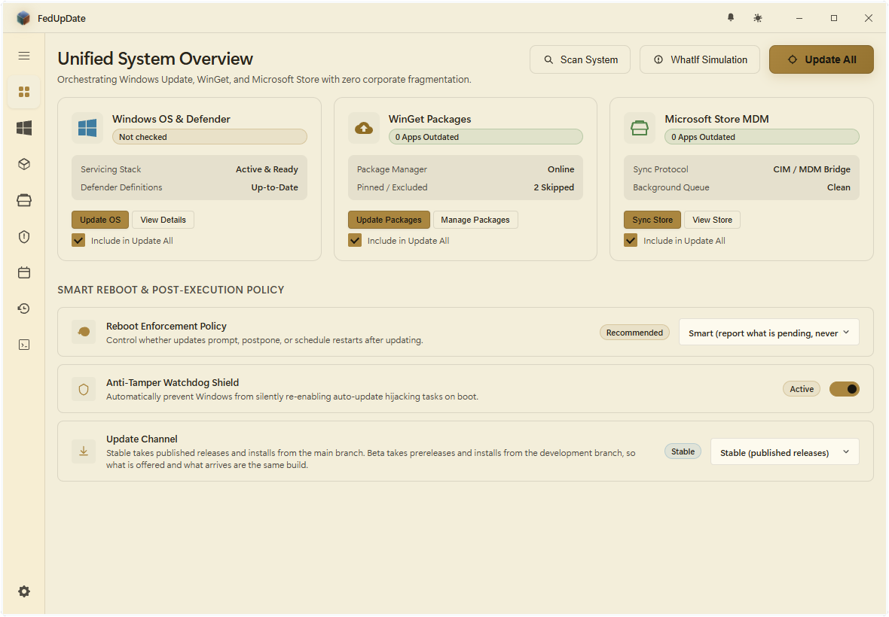
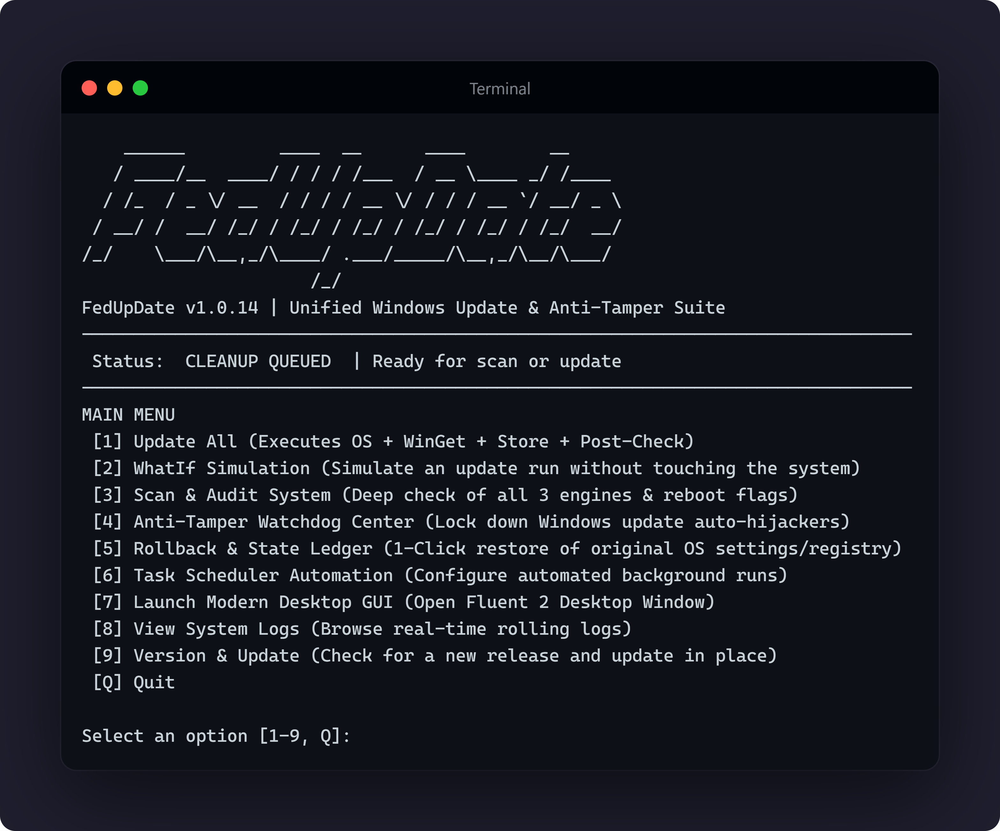

<div align="center">
  
  <h1>FedUpDate</h1>
  <p><strong>Unified Windows 11 Update &amp; Anti-Tamper Orchestrator</strong></p>
  <p><em>"Because Microsoft needs three separate corporate divisions and zero communication to update one operating system."</em></p>
</div>

[](https://github.com/Arelius-D/FedUpDate/releases) [](LICENSE) [](#) [](#) [](#-interfaces) [](#installation-zero-external-dependencies)

An ultra-lightweight, transparent, and modern Windows 11 update management suite. It unifies Windows' fragmented update engines into a single, cohesive command center while protecting user control through an active Anti-Tamper State Watchdog and a true 1-Click Rollback Engine.

---

## 🌟 Key Capabilities

- **The 3-in-1 Unified Update Engine**:
  - **OS & Defender Ring**: Native Windows Update Agent COM API (`Microsoft.Update.Session`) + Microsoft Defender Antivirus signatures (`MpCmdRun.exe`). No mid-flight forced restarts.
  - **WinGet Applications Ring**: Automated detection and upgrade of third-party software, developer tools, and runtimes via `winget.exe`.
  - **Microsoft Store Sync Ring**: WMI/CIM MDM Enterprise scan method (`MDM_EnterpriseModernAppManagement_AppManagement01:UpdateScanMethod`) and Store background sync queue.

- **Nothing Happens Until You Ask For It**:
  - Starting any of the three interfaces starts nothing. No scan, no audit, no enforcement, no elevation prompt, no network call. Every one of those is a thing you click, and until you click it the application sits there.

- **Anti-Tamper & Policy Watchdog**:
  - Eleven settings are managed: six Windows Update policy values, the `wuauserv` and `DoSvc` services, and three scheduled tasks Windows uses to restart scanning and reporting on its own.
  - The audit lists all eleven with what is on the machine now and whether it matches what you asked for. Anything it was not allowed to read says so instead of being reported as absent.
  - An on-boot persistence guard (`FedUpDate-Watchdog-Enforcer`) puts your settings back after major Windows patches revert them, and re-checks on a timer while the machine is running.
  - Whether that guard exists, when it last ran, what it put back and when it runs next is readable in every interface without administrator rights, because the application writes down what it did rather than asking Windows about a task an ordinary session is not permitted to see.

- **Reversible State Ledger & Rollback Engine**:
  - The machine is read once, at installation, before a single setting is touched. That reading is the baseline everything else is measured against.
  - After that, a setting is recorded the first time it is changed and not again, so the ledger stays a short list of what was actually altered instead of one entry per enforcement.
  - Full 1-Click Rollback (`fedupdate rollback` or in the GUI) puts the machine back to the baseline, and reports what it could not put back rather than claiming it did.

- **Full `-WhatIf` Simulation**:
  - Simulate update scans, installations, watchdog enforcements, and rollbacks without modifying a single byte on your system.

- **Honest Restart Handling**:
  - A pending restart is graded, not assumed. Servicing flags and files replaced in place mean the system is waiting; an installer's temporary folder queued for deletion is routine cleanup and is reported as exactly that, with the paths named. The interfaces never demand a restart that would not change anything.

- **Read Before You Install**:
  - Every OS update that has somewhere to read about it is offered with a link to it: the address Microsoft attached to that specific update, or its knowledge base article. Links are language-neutral, so they open in whatever language your machine asks for. An update with neither, which is most drivers, is offered no link rather than a dead one.

- **Update Channels & In-Place Updates**:
  - Follow published releases on the stable channel or prereleases on beta. Self-update pulls from the branch the chosen channel is cut from, so the version offered is always the version delivered.
  - Nothing checks for a new version until you open the version panel, and opening it does the whole job in one go: it reads what has been published, says whether this installation is behind it, shows the notes for every version in between, and puts the update button there if there is one.

- **Triple-Interface Flexibility**:
  - **Modern Fluent 2 Desktop GUI**: Glassmorphic Mica/Acrylic backdrops, an extended custom title bar the window draws itself, three status rings for the three engines, SettingsCards, badge pills, and a docked task progress drawer with a live terminal stream.
  - **Interactive Terminal TUI**: Fast keyboard-driven ANSI dashboard, one numbered menu, no mouse required.
  - **Headless CLI**: Scriptable, pipe-friendly command line for power users and automation.

- **Zero Opaque Dependencies**:
  - 100% transparent C# host and PowerShell architecture with zero bloat and zero false positives.

---

## ⚡ Quick Start

### Installation (Zero External Dependencies)

Run in PowerShell:

```powershell
irm https://raw.githubusercontent.com/Arelius-D/FedUpDate/main/install.ps1 | iex
```

No packaged installer, no prebuilt binary. The source is downloaded, `fedupdate`
is added to your User PATH and registered as a function in your PowerShell
profile, and Start Menu and Desktop shortcuts are created.

The desktop GUI is compiled on your machine during installation with the C#
compiler that ships with Windows. The only binaries involved are Microsoft's
WebView2 libraries, pulled from Microsoft's NuGet CDN.

CLI and TUI are pure PowerShell and need no compilation.

An installation is not a copy of this repository. What lands on your machine is
the entry points, `core/`, `tui/`, `gui/` and the seven image files the running
application actually reads: 32 files, under a megabyte, before the window is
compiled beside them. No licence, changelog, readme, workflow files,
screenshots or unused icon sizes travel, and anything an earlier version left
behind is removed on the next install.

Before anything is changed, the installer reads the eleven settings the shield
manages and writes them down. That reading is what a rollback and an uninstall
put back.

### Updating

FedUpDate updates itself in place, from inside the app or from the command line:

```powershell
fedupdate self-update
```

Starting the application does not check for a new version, because starting an
application is not asking it to contact anybody. You find out by asking: open
Settings and click the GitHub mark in the bottom right, or run
`fedupdate version`. Either one goes and looks, tells you what is published,
shows you what changed, and offers the update if there is one. Once asked, the
mark carries a dot for as long as an update is waiting.

Updating from inside the window closes it and opens it again by itself, because
the file it runs from has to be writable for the new one to be built into it.
That is said before it happens, and agreed to.

Two update channels are available, chosen under Settings or as `updateChannel`
in `data/config.json`:

| Channel  | Offered                          | Installs from |
|----------|----------------------------------|---------------|
| `stable` | Published releases only          | `main`        |
| `beta`   | Prereleases as well              | `dev`         |

What is offered and what arrives always come from the same place, so an
installation can never be told about a version it cannot get.

The installed version is stamped into `version.txt` at install time. The
changelog is not shipped, so the application does not read its own version out
of a file that is not there.

### Uninstalling

```powershell
fedupdate uninstall
```

The application is removed either way. The only question you are asked is what
should happen to the Windows update settings it changed, because those belong
to you and not to the installer:

| Answer | Settings | Ledger |
|--------|----------|--------|
| **1** Undo them and remove everything *(default)* | Put back as they were found at installation | Removed |
| **2** Leave them, keep the record | Kept | Saved to `Documents\FedUpDate-Backups`, so they can be undone by hand later |
| **3** Leave them, delete the record | Kept | Removed. The settings become permanent |

Pressing Enter takes answer 1. The on-boot guard is removed in every case, so
settings left in place are no longer defended and Windows may change them back.

Uninstalling removes the folder, the shortcuts, the PATH entry, the profile
function and the scheduled tasks. Removing the guard needs administrator
rights, so an ordinary session is asked for them once. If that is refused, the
uninstall says the guard is still there rather than reporting a removal that
did not happen.

Unattended:

```powershell
.\install.ps1 -Uninstall -UninstallMode RestoreDefaults -NonInteractive
```

`-NonInteractive` has no default and requires `-UninstallMode`. The accepted
values are `RestoreDefaults`, `KeepSettings` and `KeepSettingsAndPurge`.

---

<a id="interfaces"></a>

## 🖥️ Interfaces

### Desktop GUI

```powershell
fedupdate gui
```





### Terminal TUI

```powershell
fedupdate tui
# or simply
fedupdate
```



### Command Line

| Command | What it does |
|---------|--------------|
| `fedupdate scan` | Audit all three engines, reboot state and the anti-tamper shield |
| `fedupdate check` | Same audit, exit code only: `0` clean, `1` updates pending |
| `fedupdate update -All` | Run every engine, enforce the shield, then evaluate the reboot policy |
| `fedupdate update -OS` / `-Winget` / `-Store` | One engine only |
| `fedupdate update -All -WhatIf` | Simulate the whole run without touching anything |
| `fedupdate watchdog status` | Whether the boot guard is installed, when it last ran and when it runs next. Needs nothing granting |
| `fedupdate watchdog audit` | That status, then every managed setting and whether it matches |
| `fedupdate watchdog enforce` | Re-apply the shield |
| `fedupdate watchdog install-task` / `remove-task` | Add or remove the on-boot guard on its own |
| `fedupdate rollback` | List the state ledger |
| `fedupdate rollback -Latest` / `-All` / `-TransactionId <id>` | Revert recorded changes |
| `fedupdate schedule set -Frequency Daily -Time "02:00"` | Register an automated run |
| `fedupdate schedule remove` | Remove it |
| `fedupdate logs -Count 50` | Recent log entries |
| `fedupdate config` | Print the active configuration |
| `fedupdate version` | Installed version, and whether a newer one is published |
| `fedupdate self-update` | Update in place |
| `fedupdate uninstall` | Remove, with the choices described above |
| `fedupdate help` | This list. `-h`, `--help`, `-?` and `/?` work too |

Restart handling on `update` can be overridden per run with `-RebootPolicy`,
`-NoReboot`, `-ForceReboot` or `-Shutdown`. A restart is only ever forced for
something the system is genuinely waiting on, never for routine installer
cleanup.

Scanning for OS updates needs administrator rights while the shield is on, so a
scan that cannot look says it did not look. It never reports zero updates for a
check it was not allowed to run. The last successful scan is kept with the time
it was taken, so an ordinary session can still show you a real measurement and
tell you how old it is.

---

## 📁 Project Layout

``` shell
FedUpDate/
├── install.ps1                # Zero-dependency installer, updater and uninstaller
├── fedupdate.ps1              # CLI / TUI / GUI entry point
├── fedupdate.cmd              # Windows CMD and terminal wrapper
├── fedupdate-gui.vbs          # Fallback silent GUI launcher
├── core/                      # PowerShell engine
│   ├── Engine.psm1            # Module orchestrator and public surface
│   ├── OSUpdateEngine.ps1     # Windows Update Agent COM, Defender definitions, article links
│   ├── WingetEngine.ps1       # WinGet package parser and updater
│   ├── StoreEngine.ps1        # Microsoft Store MDM CIM sync
│   ├── RebootEngine.ps1       # Pending restart detection, grading and policy
│   ├── AntiTamperWatchdog.ps1 # Managed settings, audit, enforcement, boot guard, guard state
│   ├── RollbackEngine.ps1     # Install baseline, state ledger, restore
│   ├── Scheduler.ps1          # Windows Scheduled Task automation
│   ├── Config.ps1             # config.json and the data directory
│   ├── Version.ps1            # Installed version, release channel, self-update
│   └── Logger.ps1             # Structured rolling logger
├── tui/
│   └── TuiEngine.ps1          # Keyboard-driven ANSI dashboard
├── gui/                       # Fluent 2 desktop interface
│   ├── index.html             # Windows 11 Fluent 2 layout
│   ├── styles.css             # Tokenised design system (Mica, Acrylic, Fluent cards)
│   ├── app.js                 # Interface controller and state
│   ├── Server.ps1             # Local HTTP bridge between the window and the engine
│   ├── manifest.json          # Web app manifest served by the bridge
│   ├── build.ps1              # Compiles the window with the compiler shipped in Windows
│   ├── SetupLibs.ps1          # Fetches the WebView2 libraries from Microsoft
│   ├── src/Program.cs         # WPF WebView2 host, the window itself
│   └── bin/                   # Built on your machine, not committed
├── assets/                    # Brand marks
│   ├── app/                   # Splash and title bar marks used by the GUI
│   ├── desktop/               # app.ico, plus iconset and hicolor sets
│   ├── readme/                # Marks used by this file
│   ├── screenshots/           # Interface captures used by this file
│   └── web/                   # Favicon, touch icon and PWA marks
└── data/                      # Created on first run, never touched by an update
    ├── config.json            # Your preferences and rules
    ├── state_ledger.json      # The installation baseline and every recorded change
    ├── watchdog_state.json    # Whether the boot guard exists, its interval, its last run
    ├── os_scan_cache.json     # The last OS scan, with when it was taken
    ├── backups/               # Timestamped file backups
    └── logs/                  # Rolling execution log (fedupdate.log)
```

An installation also holds `version.txt`, written by the installer. Two more
files appear briefly under `data/` while an elevated helper hands its results
back to the session that asked for them.

Everything above `core/` in this listing travels to an installation. The
changelog, licence, contributing guide, security policy, workflow definitions,
`assets/readme/`, `assets/screenshots/`, `assets/desktop/hicolor/`,
`assets/desktop/iconset/` and the icon sizes nothing reads stay in the
repository, where they are for.

---

## 📜 License

[PolyForm Noncommercial License 1.0.0](LICENSE). Free to use, modify, and share for any noncommercial purpose. No person or company may use this software, or work based on it, for a commercial purpose. Built for users who want complete control, transparency, and peace of mind over their operating system updates.
